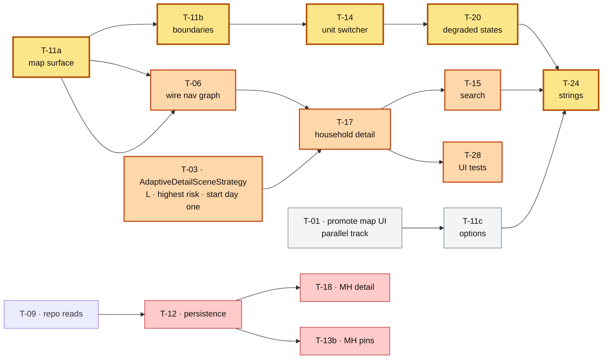
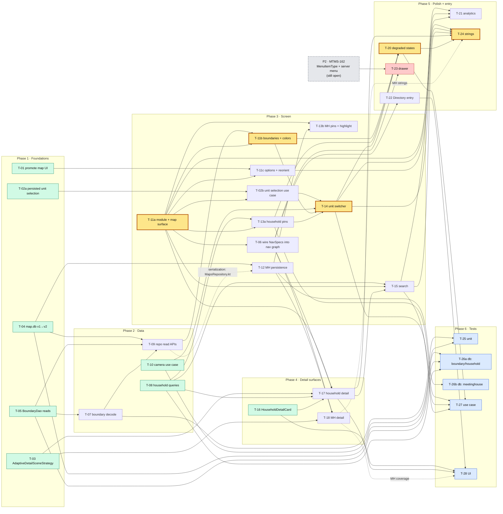

# Stake Map — Tasks

Companion to [`requirements.md`](./requirements.md) and [`design.md`](./design.md).
`R*` / `#*` / `P*` / `D*` / `N*` ids refer to those documents.

**Reviewed.** `/spec-review` returned BLOCKED; all 18 findings triaged and applied — see
`requirements.md` §8. Re-run `/spec-review feature/stakemap/spec` to confirm the verdict clears before
`/start-spec`.

> **`T-##` are task labels; the manifest ids are real.** Each task carries an **Id** field holding its
> manifest id (e.g. `MMA-6050-a`), mapped in the **Jira ticket grouping** table below. `T-##` remains only
> as a short handle for cross-references within this document. The manifest builder
> (`cmd-start-spec.sh:35`) reads `Id` and `Project`; `Id` also becomes the branch and worktree name.

Each ticket carries: **Module** (primary Gradle path, or `—` for shared-lib/spike),
**Covers** (requirement ids), **Depends** (ticket ids), **QA** (Story = user-visible, Task = internal),
**Project**, **Size**, and — for tickets that add screen UI — **Owns** (the file it is the sole editor of;
see "File ownership and merge contention" below).

---

## Prerequisites (not this repo)

| id | Ticket | Status | Repo | Task | Blocks |
|---|---|---|---|---|---|
| **P1** | [MTMS-160](https://icseng.atlassian.net/browse/MTMS-160) | ✅ **DONE** — maltSync **28.0.0** | `MemberTools-Mobile-Shared` + service | Meetinghouses delivered in the sync payload. | nothing — see the pre-handoff checklist |
| **P3** | [MTMS-161](https://icseng.atlassian.net/browse/MTMS-161) | ✅ **DONE** — maltSync **28.0.0** | `MemberTools-Mobile-Shared` | Sealed `StakeMapNavSpec` family — all three routes — under `BaseUriPath.MAP`, `NavUriUtil` registration, round-trip tests. | nothing — see the pre-handoff checklist |
| **P2** | [MTMS-162](https://icseng.atlassian.net/browse/MTMS-162) | ⏳ open | `MemberTools-Mobile-Shared` + server menu config | New `MenuItemType` value for the drawer child, plus the server-side "Maps" folder restructure. | T-23 only |

**P1 and P3 shipped in maltSync 28.0.0, and the in-repo pin bump is merged** — `upstream/main` is at
`28.0.0`. It was done by hand rather than orchestrated because 27 → 28 is a **major** bump: the app
implements `Persister` (`ToolsPersister`), so an added interface method is a compile error in `:app`;
`RemoveDataUseCase` has exhaustive `when`s over `FeatureType`; and P3 added specs to `NavUriUtil`'s `MAP`
branch. Nothing in this spec carries a dependency edge for it.

**P2 is the only remaining external prerequisite**, and it gates only the drawer row (T-23). The deep link
is the entry point until it lands. The orchestrator cannot ship P2 itself — it is single-repo
(`ship-ticket-job.sh:33-34`), and the manifest's `project (MMA|MTMS)` field is only a Jira label, not a
repo switch.

---

## Jira ticket grouping

The `T-##` items are **parts** of tickets, not tickets. Several tasks roll up to one Jira ticket for
tracking, while each keeps its own dependencies and file ownership for the orchestrator.

**Id scheme.** The manifest's `id` becomes the branch name and worktree directory
(`ship-ticket-job.sh:40-41`), manifest ops select on `.id==$id`, and the schema sets
`additionalProperties: false` — so there is no `jira` field to add and two tasks cannot share an `id`.
Instead:

* a group with **one** task uses the bare key — `MMA-4494`;
* a group with **several** uses suffixes — `MMA-1234-a`, `MMA-1234-b`, …

Either way the Jira key is the prefix, so branches, commit messages and PR titles all lead with it, which
is what `development-workflow.md` requires.

| # | Jira ticket | Key | QA | Tasks → manifest id |
|---|---|---|---|---|
| 1 | Promote shared map UI to `:core:ui` | [MMA-6048](https://icseng.atlassian.net/browse/MMA-6048) | Task | T-01 → `MMA-6048` |
| 2 | Adaptive detail scene strategy | [MMA-6049](https://icseng.atlassian.net/browse/MMA-6049) | Task | T-03 → `MMA-6049` |
| 3 | Stake map data layer | [MMA-6050](https://icseng.atlassian.net/browse/MMA-6050) | Task | T-04 → `MMA-6050-a`, T-05 → `MMA-6050-b`, T-07 → `MMA-6050-c`, T-08 → `MMA-6050-d`, T-09 → `MMA-6050-e`, T-26a → `MMA-6050-f` |
| 4 | Stake map screen shell + navigation | [MMA-6051](https://icseng.atlassian.net/browse/MMA-6051) | Task | T-11a → `MMA-6051-a`, T-06 → `MMA-6051-b`, T-11c → `MMA-6051-c` |
| 5 | Ward & stake boundaries on the map | [MMA-4494](https://icseng.atlassian.net/browse/MMA-4494) | Story | T-11b → `MMA-4494` |
| 6 | Household pins | [MMA-6052](https://icseng.atlassian.net/browse/MMA-6052) | Story | T-13a → `MMA-6052` |
| 7 | Unit switcher + default camera | [MMA-6053](https://icseng.atlassian.net/browse/MMA-6053) | Story | T-02a → `MMA-6053-a`, T-02b → `MMA-6053-b`, T-10 → `MMA-6053-c`, T-14 → `MMA-6053-d`, T-25 → `MMA-6053-e` |
| 8 | Household search | [MMA-6054](https://icseng.atlassian.net/browse/MMA-6054) | Story | T-15 → `MMA-6054` |
| 9 | Household detail | [MMA-6055](https://icseng.atlassian.net/browse/MMA-6055) | Story | T-16 → `MMA-6055-a`, T-17 → `MMA-6055-b` |
| 10 | Meetinghouse pins & detail | [MMA-6056](https://icseng.atlassian.net/browse/MMA-6056) | Story | T-12 → `MMA-6056-a`, T-13b → `MMA-6056-b`, T-18 → `MMA-6056-c`, T-26b → `MMA-6056-d` |
| 11 | Entry points — Directory & drawer | [MMA-6057](https://icseng.atlassian.net/browse/MMA-6057) | Story | T-22 → `MMA-6057-a`, T-23 → `MMA-6057-b` |
| 12 | Degraded states, analytics & strings | [MMA-6058](https://icseng.atlassian.net/browse/MMA-6058) | Task | T-20 → `MMA-6058-a`, T-21 → `MMA-6058-b`, T-24 → `MMA-6058-c`, T-27 → `MMA-6058-d`, T-28 → `MMA-6058-e` |

All twelve are **Enhancement** under epic **LTS-1562**, matching how the LTS-2600 Calendar work is
broken down in MMA.

Single-task groups use the bare key; the rest carry `-a`/`-b`/… suffixes assigned in dependency order.

---

## Pre-handoff checklist

| | Item | Status |
|---|---|---|
| 1 | **maltSync 28.0.0 pin bump** | ✅ **merged** — `upstream/main` @ `7ea5e3554e` has `maltSync = "28.0.0"` (`libs.versions.toml:127`); `origin/main` matches, 0 ahead / 0 behind |
| 2 | **Jira tickets created, `T-##` ids replaced** | ✅ **done** — 12 tickets under LTS-1562; every task carries an **Id** field, mapped in the grouping table above |
| 3 | **Pick the base branch** | ⏳ `--base upstream/main` (recommended — the canonical repo per `development-workflow.md`, and it carries 28.0.0) |

Nothing here is a ticket.

Note this spec's own worktree is still pinned to `27.1.0` — it branched before the bump merged. Harmless
for the run, because `ship-ticket-job.sh` creates every ticket worktree from `$BASE`, not from this one.
But building or testing *inside the StakeMap worktree* puts you on 27.1.0, so bring it up to date with
`main` first.

---

## Phase 1 — Foundations (no feature code; unblocks everything)

### T-01 · Promote shared map UI to `:core:ui`
**Module** `:core:ui` · **Covers** `#22`, `N1`, `N2` · **Depends** — · **QA** Task · **Project** MMA ·
**Size** M
**Id** `MMA-6048`

*(`Covers` includes `N1` — this ticket is where "no new repo/database dependency in `:core:ui`" is
asserted. `verify.sh` never runs `projectHealth`, so it is an explicit "Done when" item below.)*

Move (do not copy) `LayersButton`, `ReorientButton`, `MapUiUtil`, the `ic_map_*` drawables and
`dimens.xml` from `:feature:map` into `:core:ui/map`. **Also move `MeetinghouseMapsBottomSheets`'
`MapTypeSelectionVerticalGrid`** (drop `internal`, rename to drop the misleading "AndLayer" — it already
renders map type only). Update `:feature:map` imports.

**`MapEvent` / `HandleEvents` are deliberately NOT promoted.** There are already **two divergent
`MapEvent` sealed interfaces** in `:feature:map` — `ToolsMapUiModel.kt:91`
(`MoveCameraBounds(List<LatLng>, animate)`) and `MeetinghouseMapUiModel.kt:46`
(`MoveCameraBounds(LatLngBounds)`, plus `MoveCameraLocationZoom` and `RequestGoToLocationPermission`) —
with incompatible members, and `HandleEvents` is duplicated alongside them. Unifying them is a refactor of
two shipping screens, not a move. `:feature:stakemap` declares its own (T-11a); reconciliation belongs to
the `:feature:map` retirement (**F-02**).

`MapViewUtils.MaxZoom` and `raw/maps_style` are **already** in `:core:ui` — nothing to promote there.

**Done when:** `:feature:map` builds, all its existing tests pass, `:app:projectHealth` clean, no new
repo/database dependency in `:core:ui`.
**Not on the critical path** — no feature ticket depends on this; T-11c is its only consumer.

### T-02a · Persisted stake-map unit selection on `BackdropUnitRepository`
**Module** `:repo:unit` · **Covers** `R2.2b`, `#25` · **Depends** — · **QA** Task · **Project** MMA ·
**Size** S
**Id** `MMA-6053-a`

Add a `getCurrentStakeMapUnitFlow()` / `setCurrentStakeMapUnitAsync()` pair plus its preference key,
matching the existing per-feature pairs (`getCurrentDirectoryUnitFlow`, `getCurrentGroupsUnitFlow`,
`getCurrentFinanceUnitFlow`, …). Repository-layer only — no use case here.

### T-02b · `GetStakeMapUnitSelectionUseCase`
**Module** `:feature:stakemap` · **Covers** `R2.2`, `R2.2a` · **Depends** T-02a, T-11a · **QA** Task ·
**Project** MMA · **Size** S
**Id** `MMA-6053-b`

Extends `UnitSelectionUseCase`, sourcing `getAllSubscribedUnitsFlow()` (ecclesiastical only — missions
excluded by construction) plus the parent stake via `ChurchUnit.parentUnitNumber`. A `unitNumber` argument
overrides the persisted value and is written through.

**Lives in the feature module, not `:repo:unit`.** That is the dominant convention — `:feature:groups`,
`:feature:finance` (×2), `:feature:missionary` and `:feature:calling` all keep their
`UnitSelectionUseCase` subclass in the feature. The two repo-module cases (`:repo:directory`,
`:repo:unit/{record,report}`) exist only because those areas are still in `:app` and have no feature
module to live in.

**Must not** reuse `GetDirectoryUnitSelectionUseCase` — its `onUnitSelected` writes
`setCurrentDirectoryUnitAsync`, the selection Directory *and* `SearchViewModel` read.
**Done when:** switching units on the map provably does not change Directory's or Search's unit.

### T-03 · `AdaptiveDetailSceneStrategy` in `:core:ui`
**Module** `:core:ui` · **Covers** `R11`, `#8` · **Depends** — · **QA** Task · **Project** MMA ·
**Size** L
**Id** `MMA-6049`

Expanded → supporting-pane semantics; compact → main full-bleed + detail in a `BottomSheetScaffold`
sheet, sheet dismissal pops the detail entry. `mainPane()` / `detailPane()` metadata helpers. Register in
`Nav3Host`. Add `api(libs.androidx.compose.material3.adaptive.navigation3)` (alias exists,
`libs.versions.toml:169`).

**Must handle a lone detail entry — decided: synthesise the main pane.**
`MainActivity.seedWithDeepLink` (`:189-201`) seeds `NavSpec.parentChain` **only on medium+ windows**; on
compact it deliberately seeds just the leaf, so a cold deep link to a detail arrives with **no main entry
beneath it** — a bottom sheet over nothing.

When the strategy is handed a `detailPane` entry with no `mainPane` entry beneath it, it **synthesises the
main pane from the entry's own `NavSpec.parentChain`**, so the destination looks identical however the user
reached it.

Two constraints on the implementation:

* Read `parentChain` from the spec — do **not** hard-code or infer a parent. That keeps one source of
  truth for *what* the parent is, even though the host and the strategy now both decide *when* to add one.
* Drop parents the host cannot resolve, exactly as `seedWithDeepLink` does
  (`installers.canResolve(it)`), so an unregistered parent cannot crash the scene.
* If `parentChain` is empty, fall back to rendering the detail full-screen rather than an empty scene.

**Done when:** one `NavKey` and one backstack entry at both widths; fold/unfold and rotate with a detail
open re-render the same entry with no state loss; back/dismiss returns to main; **and a detail entry with
no main beneath it renders sensibly rather than crashing or showing an empty map.**
**⚠ Highest-risk ticket in the spec. No dependencies — build and prove it first, in isolation.**

### T-04 · `map.db` v1 → v2
**Module** `:database:map` · **Covers** `N3` · **Depends** — · **QA** Task · **Project** MMA · **Size** M
**Id** `MMA-6050-a`

`MeetinghouseEntity`, `MeetinghouseUnitEntity` (+ `unitNumber` index), `MeetinghouseDao`, bump
`@Database` version, add the migration, extend `MapDatabase.validateDatabase` beyond `"Boundary"`.

Schema JSON: while v2 is in flux the generated file stays **out of commits by not adding it** (do **not**
add `database/**/schemas/**` to `.gitignore`); **commit it once v2 is locked**, since tracked schemas are
what migration validation reads. `:database:map` is KMP — see `N6`.

### T-05 · `BoundaryDao` read queries
**Module** `:database:map` · **Covers** `R7.1` · **Depends** — · **QA** Task · **Project** MMA ·
**Size** S
**Id** `MMA-6050-b`

`findAllByProxyFlow(proxy)` and `findByUnitFlow(unitNumber, proxy)`. The `proxy` predicate is mandatory —
`MapsRepository.deleteBoundaries` already partitions on it.

---

## Phase 2 — Data

### T-07 · Boundary decode + bounds
**Module** `:repo:maps` · **Covers** `R3.1` · **Depends** T-05 · **QA** Task · **Project** MMA ·
**Size** S
**Id** `MMA-6050-c`

`BoundaryLines.decode()` → `List<List<LatLng>>` via `PolyUtil.decode`, plus per-unit `LatLngBounds`
accumulation (the `getUnitBounds()` input for T-10). Add
`implementation(libs.google.maps.utils.ktx)` to `:repo:maps`.

**Lives in `:repo:maps`, not `:database:map`** — that module is KMP `commonMain` and cannot take
`LatLng`/`PolyUtil`. (Spec-review blocking finding 2.)

### T-08 · Household map queries
**Module** `:database:member` · **Covers** `R5.1`, `R7`, `R8.2`–`R8.4` · **Depends** — · **QA** Task ·
**Project** MMA · **Size** M
**Id** `MMA-6050-d`

Household-grained query modeled on `INDIVIDUAL_SEARCH_BASE_QUERY`, adding `household.displayName` to the
`WHERE`, keeping `toPhoneQueryTerm()` normalization, proxy-scoped, in two variants: pins (`lat`/`lng` NOT
NULL) and search (no coordinate filter). KMP module — see `N6`.

### T-09 · `:repo:maps` read APIs
**Module** `:repo:maps` · **Covers** `R3.1`, `R6.1`, `R7` · **Depends** T-04, T-05, T-07 · **QA** Task ·
**Project** MMA · **Size** S
**Id** `MMA-6050-e`

Repository flows for boundaries-by-proxy and meetinghouses-by-proxy, returning decoded/domain types
rather than entities.

### T-10 · `GetStakeMapCameraTargetUseCase`
**Module** `:feature:stakemap` · **Covers** `R4` · **Depends** — · **QA** Task · **Project** MMA ·
**Size** M
**Id** `MMA-6053-c`

Pure port of Ryan's `zoomToUnit`. Returns `CameraTarget(bounds, extraPaddingDp)` or `null`. No Compose,
no Android. Five-branch table in design §7. *Small code — the tests are the deliverable.*

---

## Phase 3 — Screen

### T-11a · `:feature:stakemap` module + map surface + **file skeleton**
**Module** `:feature:stakemap` · **Covers** `R1.1`, `R1.4` · **Depends** — · **QA** Task ·
**Project** MMA · **Size** M
**Owns** `StakeMapScreen.kt`, `StakeMapUiState.kt`, `di/FeatureStakeMapKoinModule.kt`,
**Id** `MMA-6051-a`
`settings.gradle.kts`, `AllKoinModules.kt`

**No dependencies** — the nav wiring moved to T-06, so module and screen work starts on day one, in
parallel with **P3**. **Done when** additionally: `:app:projectHealth` is clean (adding a module changes
the dependency graph, and `verify.sh` never runs `projectHealth`). New module + convention-plugin wiring, Koin module. `GoogleMap` configured like
`MeetinghouseMapsScreen` (style, max/min zoom, disabled UI settings, my-location on permission) and the
go-to-my-location FAB. Declares its own `MapEvent` + event handler (see T-01 for why it isn't shared).

h4. This ticket also lands the file skeleton — read before starting

Eight tickets add UI to this screen. If they all edit `StakeMapScreen.kt` they will collide, because the
orchestrator runs tickets **concurrently in separate worktrees with separate PRs** and has no file-level
locking (`ship-ticket-job.sh:157-163` only refuses a stale base and escalates to a human).

So T-11a lands `StakeMapScreen.kt` as a **thin assembler** plus **empty stub files, one per concern**, and
every later ticket fills its own file and touches nothing shared:

| Stub file created here | Filled by |
|---|---|
| `StakeMapBoundaries.kt` | T-11b |
| `StakeMapMarkers.kt` | T-13a (households) |
| `StakeMapMeetinghouseMarkers.kt` | T-13b |
| `StakeMapMapControls.kt` | T-11c |
| `StakeMapUnitChip.kt` | T-14 |
| `StakeMapSearchBar.kt` | T-15 |
| `StakeMapMessages.kt` | T-20 |

Same treatment for DI: `FeatureStakeMapKoinModule` is created with `includes(...)` of one stub sub-module
per area (`stakeMapUseCaseModule`, `stakeMapDetailModule`, `stakeMapAnalyticsModule`). Later tickets add to
*their* sub-module file, not the aggregator. The **Nav3** module is T-06's, and T-06 creates the per-detail
nav sub-module stubs that T-17 and T-18 fill.

The assembler calls every stub in final z-order up front, so no later ticket has to edit it. This is also
better Compose structure than one 400-line screen composable, so it costs nothing.

**Only T-06 is a dependency** — and only because the entry needs a `NavKey` to register against.
Deliberately **not** dependent on:
- **T-03** — register a plain `entry<StakeMapNavSpec>` and render full-screen. Scene metadata only matters
  once a detail pane exists to pair with, so `AdaptiveDetailSceneStrategy.mainPane(...)` is added by
  T-17. This keeps the L-sized, highest-risk ticket **off the feature's critical path**.
- **T-01** — `MapUiUtil` is markers (T-13a/b), the buttons and sheet are T-11c, and
  `MapViewUtils`/`maps_style` are already in `:core:ui`.
- **T-02a/T-02b** — the unit switcher is T-14. (Note T-02b depends on *this* ticket, not the reverse:
  the use case needs the module to exist.)

### T-06 · Wire the shared NavSpecs into the nav graph
**Module** `:feature:stakemap` · **Covers** `R12.2` · **Depends** T-11a · **QA** Task ·
**Project** MMA · **Size** S
**Owns** `di/Nav3StakeMapKoinModule.kt`
**Id** `MMA-6051-b`

Registers the **three shared MaltSync specs** delivered by **P3**
([MTMS-161](https://icseng.atlassian.net/browse/MTMS-161), shipped in maltSync 28.0.0, which is on the
classpath before handoff) as Nav3 entries. **All three routes are
shared — this feature declares no local `NavKey`s at all.**

# `StakeMapNavSpec` → the `AdaptiveDetailSceneStrategy.mainPane` entry, pointing at T-11a's
  `StakeMapScreen`.
# `StakeMapHouseholdNavSpec` and `StakeMapMeetinghouseNavSpec` → `detailPane` entries in the same scene.
  T-17 and T-18 supply the composables and ViewModels; this ticket creates the registration slots.
# Create the nav sub-module stubs `di/Nav3StakeMapHouseholdKoinModule.kt` and
  `di/Nav3StakeMapMeetinghouseKoinModule.kt`, `includes()`-ed by the aggregator, so T-17 and T-18 each fill
  their own file instead of colliding in one (see "File ownership and merge contention").

**No `navKeySerializers` block.** All three are MaltSync `NavSpec`s and are therefore already in the
central serializers module — the same reason `Nav3MapsKoinModule` registers a serializer only for
`DropPinOnMapNavKey` and not for its four NavSpecs. Registering a `NavKey` serializer twice crashes at
runtime, so adding one here would be an active bug.

**Done when:** all three URIs open the right surface on device:

{code}
/MAP/STAKE?unitNumber={unitNumber}
/MAP/STAKE/MEETINGHOUSE/{meetinghouseId}
/MAP/STAKE/HOUSEHOLD/{unitNumber}/{householdUuid}
{code}

**This is the test entry point for everything downstream**, since the drawer row is server-gated (**P2**).

*Scope note: this is the in-repo half of what used to be one T-06 — the shared-library half is **P3**,
because the orchestrator cannot ship cross-repo work. Size dropped M → S once the local keys and the
serializer block went away.*

### T-11b · Boundary rendering + colors
**Module** `:feature:stakemap` · **Covers** `R3` · **Depends** T-09, T-11a · **QA** Story ·
**Project** MMA · **Size** M · **Ticket** MMA-4494 *(sole task — manifest id is `MMA-4494`)*
**Owns** `StakeMapBoundaries.kt`
**Id** `MMA-4494`

Non-clickable `Polyline`s in **others → stake → selected** z-order. Colors are existing theme roles —
`colorScheme.primary` / `AppTheme.extendedColors.success.color` / `colorScheme.error`. No new palette
object, no design input required.

### T-11c · Map-options button + reorient
**Module** `:feature:stakemap` · **Covers** `R1.2`, `R1.3`, `#18` · **Depends** T-01, T-11a · **QA** Task ·
**Project** MMA · **Size** S
**Owns** `StakeMapMapControls.kt`
**Id** `MMA-6051-c`

Promoted `LayersButton` opening the promoted map-type sheet (map type only), reading/writing the shared
`MapPreferenceDataSource.lastMapTypeFlow`. `ReorientButton` on non-zero bearing.

### T-12 · Meetinghouse persistence
**Module** `:repo:maps` · **Covers** `R6.4` · **Depends** T-04, T-09 · **QA** Task ·
**Project** MMA · **Size** M
**Owns** `MapsRepository.kt` (shared with T-09 — hence the T-09 edge)
**Id** `MMA-6056-a`

*P1 shipped in maltSync 28.0.0 and the pin bump lands before handoff, so there is no external gate here at all. T-09 is a
serialization edge, not a logical one: both tickets edit `MapsRepository.kt` and would
otherwise become ready concurrently. Ordering them costs nothing, since T-12 is **P1**-blocked anyway.*

Implement `MapsRepository.processAndSaveMeetinghouses` / `deleteMeetinghouses` (currently `TODO` stubs),
writing `MeetinghouseEntity` + one `MeetinghouseUnitEntity` per `DtoLocation.wards` element, in a
transaction. No new Android sync wiring needed — `AndroidDataProcessor` → `ToolsPersister` →
`RemoveDataUseCase` already route it.

### T-13a · Household pins
**Module** `:feature:stakemap` · **Covers** `R5` · **Depends** T-08, T-11a · **QA** Story ·
**Project** MMA · **Size** M
**Owns** `StakeMapMarkers.kt`
**Id** `MMA-6052`

Cached `BitmapDescriptor`s hoisted once per screen (selected + unselected), `Marker` with stable
`key(householdUuid)`, viewport filter with margin. **Deliberately independent of P1.**

**Done when:** a 600-household unit stays interactive (`R5.4`).

*Not a duplicate of MMA-5292* ("Households - Show Pins for Household Locations on the Map", Resolved, same epic) — that shipped household pins on a **different** map surface. It is why `ic_map_household_pin` / `_circle` / `_extra` and `MapPreferenceDataSource.showHouseholdsFlow` already exist; this task reuses those drawables and needs no new assets.

### T-13b · Meetinghouse pins + selected-unit highlight
**Module** `:feature:stakemap` · **Covers** `R6` · **Depends** T-11a, T-12 · **QA** Story ·
**Project** MMA · **Size** S
**Owns** `StakeMapMeetinghouseMarkers.kt`
**Id** `MMA-6056-b`

All meetinghouses in the unselected variant; the selected unit's building(s) always in the selected
variant via `MapUiUtil.getMarkerIcon(selected = true)`, independent of anything else.

### T-14 · Unit switcher
**Module** `:feature:stakemap` · **Covers** `R2` · **Depends** T-02b, T-10, T-11b, T-13a · **QA** Story ·
**Project** MMA · **Size** M
**Owns** `StakeMapUnitChip.kt`
**Id** `MMA-6053-d`

`UnitSelectionChip` under the search bar, driven by T-02b's use case. Hidden when one entry
(`showUnitSwitcherFlow` pattern). Selection re-queries pins, recolors boundaries, and recenters via T-10.

### T-15 · Search + docked dropdown
**Module** `:feature:stakemap` · **Covers** `R8` · **Depends** T-08, T-11a, T-17 · **QA** Story ·
**Project** MMA · **Size** M
**Owns** `StakeMapSearchBar.kt`
**Id** `MMA-6054`

`ToolsSearchBar` with a docked result dropdown. Household-grained rows (name + address, matched member
name as supporting text). Tap with coordinates → select pin + recenter + open detail; tap without → open
detail only, no pin, no camera move (`R8.4`).

Depends on T-17 (household detail) but **not** T-18 — search returns households only, so it must not
inherit T-18's **P1** block.
**Watch:** no `@Composable` calls in composable arguments — this project has a recorded focus/keyboard-loss
regression from exactly that.

---

## Phase 4 — Detail surfaces

### T-16 · `HouseholdDetailCard` in `:core:ui`
**Module** `:core:ui` · **Covers** `R9.1`, `R9.4` · **Depends** — · **QA** Task · **Project** MMA ·
**Size** M
**Id** `MMA-6055-a`

*(No dependency on T-01 — this card uses `PersonPhoto` and `ListItem`, both already in `:core:ui`, and
nothing from the map promotion.)*

State-hoisted composable + `UiState`/`UiModel` data classes **only** — household name, address, member
list with photos. No repo/database dependency in `:core:ui`. Previews for empty / populated / long-name.

### T-17 · Household detail wiring
**Module** `:feature:stakemap` · **Covers** `R9` · **Depends** T-03, T-06, T-08, T-11a, T-16 ·
**QA** Story · **Project** MMA · **Size** M
**Owns** `di/Nav3StakeMapHouseholdKoinModule.kt`
**Id** `MMA-6055-b`

Feature-side `GetStakeMapHouseholdDetailUiStateUseCase` (keyed by `HouseholdUuid`), ViewModel, NavKey +
and the `AdaptiveDetailSceneStrategy.detailPane` entry body for the **shared**
`StakeMapHouseholdNavSpec` (registered by T-06; no local key, no serializer registration here).
Member tap → profile. No pull-to-refresh, no edit-calling.

**This is where T-03 lands in the graph.** It also adds
`AdaptiveDetailSceneStrategy.mainPane(STAKE_MAP_SCENE)` metadata to T-11a's existing root entry — the
first point at which a main/detail pairing exists.

### T-18 · Meetinghouse detail
**Module** `:feature:stakemap` · **Covers** `R10`, `#26` · **Depends** T-03, T-06, T-12 · **QA** Story ·
**Project** MMA · **Size** M
**Owns** `di/Nav3StakeMapMeetinghouseKoinModule.kt`
**Id** `MMA-6056-c`

Title, address (tap → directions), raw coordinates line, facility/info link, and "All Wards Meeting Here"
with per-unit stake name (derived from local `ChurchUnit.parentUnitNumber`, omitted when unresolvable),
unit name, unit number, and the meeting day/time line from the existing `maps_first_meeting_dow` /
`maps_sacrament_meeting_dow` strings. Selected unit's row visually distinguished. Ward row tappable only
when locally resolvable. **No language field.**

Directions and the facility link **mirror the Locator's** `DirectionsButton` / `onActivitiesClick`
mechanisms exactly — no new external-vs-in-app decision.

---

## Phase 5 — Polish and entry points

### T-20 · Degraded states
**Module** `:feature:stakemap` · **Covers** `R13` · **Depends** T-11b, T-13a, T-14 · **QA** Story ·
**Project** MMA · **Size** M
**Owns** `StakeMapMessages.kt`
**Id** `MMA-6058-a`

(a) No boundary → fit household pins, else last camera position. (b) Households but none geocoded →
non-blocking message. (c) Empty meetinghouse table → normal state, no error. (d) Offline → **brief**
snackbar (not the Locator's indefinite one); pins and boundaries still draw.

### T-21 · Analytics
**Module** `:feature:stakemap` · **Covers** `R14` · **Depends** T-11a, T-14, T-15 · **QA** Task ·
**Project** MMA · **Size** S
**Id** `MMA-6058-b`

`StakeMapAnalytics` following `MapAnalytics`' shape: screen view, unit switch, search, household
selection, meetinghouse selection.

### T-22 · Directory entry point
**Module** `:app` · **Covers** `R12.1` · **Depends** T-06 · **QA** Story · **Project** MMA · **Size** S
**Id** `MMA-6057-a`

`IconButton(Icons.Rounded.Map)` in `DirectoryListScreen`'s `ToolsAppBar` actions, before `AppBarMenu`,
navigating with Directory's current unit from its existing `UnitSelectionUiState.currentUnitFlow`. The
hand-off is **one-way** — the map never writes back to Directory's selection (T-02a/T-02b).

### T-23 · Drawer registration
**Module** `:feature:stakemap` · **Covers** `R12.3` · **Depends** T-06, **P2** · **QA** Task ·
**Project** MMA · **Size** S
**Id** `MMA-6057-b`

`drawerInstaller` binding `DrawerSpec.Navigation` for the new `MenuItemType` → `StakeMapNavSpec()`.
Inert until the server sends the item.

### T-24 · Strings + localization pass
**Module** `:core:strings` · **Covers** `R15` · **Depends** T-11c, T-14, T-15, T-17, T-20 · **QA** Task ·
**Project** MMA · **Size** S
**Id** `MMA-6058-c`

Audit every new string against `:core:strings` and the iOS `IosStrings.kt` catalog before adding —
iOS-shipped copy is frequently already translated and merely unrendered on Android. Meetinghouse-detail
strings land with T-18.

---

## Phase 6 — Tests (`#23`)

Each should land **with** its ticket rather than after; listed separately for visibility. There is no
convention-gates ticket — see "Removed: the convention-gates ticket" below.

### T-25 · Unit — camera algorithm + boundary decode
**Module** `:feature:stakemap`, `:repo:maps` · **Covers** `R4`, `R3.1` · **Depends** T-07, T-10 ·
**QA** Task · **Project** MMA
**Id** `MMA-6053-e`

One test per branch of design §7 (`null` bounds, `<=1` in-unit, `<0.75` ratio, `>=0.3` area, the hit
case), plus `PolyUtil` ring decoding of `List<List<String>>` including multi-ring input.

### T-26a · Database — boundary + household queries, and the v1→v2 migration
**Module** `:database:map`, `:database:member` · **Covers** `N3`, `N6`, `R7`, `R8.2` · **Depends** T-04,
**Id** `MMA-6050-f`
T-05, T-08 · **QA** Task · **Project** MMA

`src/jvmTest` coverage for:

* the new `BoundaryDao` reads — **asserting the proxy predicate**, since omitting it is how proxy and real
  boundaries end up on one map;
* both household-map query variants — pins (`lat`/`lng` NOT NULL) and search (no coordinate filter), and
  each matched field: household name, address, member name, phone (via `toPhoneQueryTerm()`) and email;
* a `BaseDatabaseMigrationTest` subclass for `map.db` v1→v2.

Run via `:database:<module>:jvmTest`. **Not** `testDebugUnitTest` — `verify.sh`'s outer gate (`T2`) cannot
reach KMP modules, only its `--inner --module` tier can (`N6`).

**Deliberately excludes meetinghouse coverage**, so this lands in the same window as T-04/T-05/T-08
instead of waiting on T-12. That was the whole reason for the split.

### T-26b · Database — meetinghouse tables and the sync round trip
**Module** `:database:map`, `:repo:maps` · **Covers** `R6.4` · **Depends** T-12 · **QA** Task ·
**Project** MMA
**Id** `MMA-6056-d`

`MeetinghouseDao` reads and the `MeetinghouseUnit` join, plus a round trip over
`processAndSaveMeetinghouses`: a `DtoLocation` with a populated `wards` list writes one
`MeetinghouseEntity` and one join row per ward, keyed on `locationId` / `ChurchUnit.unitNumber`, and
`deleteMeetinghouses(proxy)` removes both sides. Proxy-scoped.

### T-27 · Use case / ViewModel — Turbine
**Module** `:feature:stakemap` · **Covers** `R2`, `R8`, `R13` · **Depends** T-13a, T-14, T-15, T-20 ·
**QA** Task · **Project** MMA
**Id** `MMA-6058-d`

Unit switch → pins + colors + camera; search → results incl. the un-geocoded case; selection → detail
state; all four degraded states; a proxy-unit selection; **and an assertion that a map unit switch does
not mutate Directory's or Search's selection** (`R2.2a`).

### T-28 · UI — screenshot, Robolectric, isolated flow
**Module** `:core:ui`, `:feature:stakemap`, `:app` · **Covers** `R9`, `R10`, `R12.1` ·
**Depends** T-16, T-17, T-22 · **QA** Task · **Project** MMA
**Id** `MMA-6058-e`

- Robolectric: search dropdown interaction and result-tap branching.
- Isolated instrumentation: Directory → map → household detail → member profile.
- **Screenshot goldens deferred until after the design review (`#24`)** so they don't freeze a guess.
  Meetinghouse-detail coverage lands with T-18.

Run `/evaluate-screen-tests` first to confirm the harness per screen.

---

## Removed: the convention-gates ticket

There is no "run the gates" ticket. The orchestrator's pipeline is
`plan → implement → code-review → test-review → **pre-pr** → pr` (`ship-ticket-job.sh:11`), and the
`pre-pr` phase runs `verify.sh --pre-pr`, which already covers every gate that ticket listed:

| Gate | Where it runs |
|---|---|
| all module unit tests | `verify.sh` T2 — `testDebugUnitTest` |
| `KoinModuleTest` (`N4`) **and every Konsist test** — `NavApiModuleTest`, the DAO rules (`N5`) | `verify.sh` T3 — `:app:testDebugUnitTest --tests KoinModuleTest --tests "*konsist*"` |
| `lintDebug`, `assembleDebug` | `verify.sh` T4, T5 |
| `detekt detektDebug` | `verify.sh` P1 |
| `koverVerifyAlpha`, `koverVerifyJvm` | `verify.sh` P2 — CI parity, catches alpha-variant-only failures the debug gate misses |
| KMP `jvmTest` (`N6`) | `verify.sh --inner --module :database:*`, in the coder's own loop — **and asserted by T-26a** |

A separate ticket would re-run all of it once, after the fact, adding nothing. Two items are **not**
covered and were relocated rather than dropped:

* **`:app:projectHealth`** appears nowhere in `verify.sh`. It is now a "Done when" item on the two tickets
  that actually change the dependency graph — **T-01** (moves code into `:core:ui`) and **T-11a** (adds a
  module).
* **KMP `jvmTest`** is unreachable from the outer gate, which is exactly what `N6` warns about; **T-26a**
  owns asserting it.

---

## Removed: backstack seeding

There is no seeding ticket. `MainActivity.seedWithDeepLink` (`:189-201`) already expands any `NavSpec`
into `base + parentChain + key`, filters parents the host cannot resolve, and dedupes — and maltSync
28.0.0 declares `parentChain` on both detail specs (`StakeMapMeetinghouseNavSpec` →
`listOf(StakeMapNavSpec())`, `StakeMapHouseholdNavSpec` → `listOf(StakeMapNavSpec(unitNumber))`). Six other
spec families already rely on this. **Nothing to build** — the one consequence is the compact-window case
now folded into T-03.

## File ownership and merge contention

The dependency graph encodes **logical** order only. The orchestrator runs up to
`maxConcurrentBuilds: 2` tickets **concurrently, in separate git worktrees, as separate PRs**, and has
**no file-level locking** — `guard_worktree_trust` (`ship-ticket-job.sh:157-163`) only refuses to PR on a
stale base and escalates to a human to rebase. So same-file tickets that become ready together *will*
conflict unless the spec prevents it.

Three mechanisms, in order of preference:

**1. File-per-concern skeleton (the main one).** T-11a creates the assembler plus one empty stub file per
concern, and each later ticket fills only the file in its **Owns** field. This is what removes the two
worst hotspots — `StakeMapScreen.kt` (8 tickets) and the feature Koin module (~8 tickets). See T-11a.

**2. Serialization edges.** Where two tickets genuinely must edit one file, an artificial `Depends:` edge
orders them. Currently one: **T-09 → T-12** on `MapsRepository.kt`. It is free, because T-12 is
**P1**-blocked regardless.

**3. Accepted contention.** `:core:strings/strings.xml` is touched by T-11c, T-14, T-15, T-17, T-18, T-20,
T-22 and T-24 — and by *other teams'* tickets, so it cannot be owned by this spec. Left unserialized
deliberately: the edits are append-only additions of distinct `<string>` elements, which is the cheapest
class of conflict to resolve and carries no risk of silent semantic breakage. Whoever resolves takes both
sides.

Collisions **checked and found not to exist**: `core/ui/build.gradle.kts` (T-01 adds no dependency —
`:core:ui` already has `google.play.services.maps` and `google.maps.compose` at lines 64-65, so only T-03
edits it); `MapDatabase.kt` vs `BoundaryDao.kt` (T-04 and T-05 touch different files);
`settings.gradle.kts` and `AllKoinModules.kt` (T-11a only).

## Dependency graph

### Critical path at a glance

Amber is the longest chain (six tickets, no L-sizes, no prerequisites). Orange is the **second chain that
matters more than its length suggests** — T-03 is the only L-sized, highest-risk ticket and four tickets
wait on it, so start it day one. Grey is genuinely off the path.

### Full graph

**Legend** — green: startable now (no dependencies) · amber: critical path · red: gated on an external
prerequisite · grey dashed: the prerequisite itself · blue: test tickets. Dotted edges are **soft**:
T-18 supplies only the meetinghouse *branch* of T-24/T-28, so those tickets are not blocked by it.
**There is no convention-gates ticket** — `verify.sh --pre-pr` runs those gates on every ticket before its
PR (see "Removed: the convention-gates ticket").

### Authoritative list

The table below is the source of truth; the diagrams are derived from it. Every dependency appears exactly
once, in both directions.

| Ticket | Depends on | Unblocks |
|---|---|---|
| **T-01** promote map UI | — | T-11c |
| **T-02a** persisted unit selection | — | T-02b |
| **T-03** AdaptiveDetailSceneStrategy | — | T-17, T-18 |
| **T-04** map.db v1→v2 | — | T-09, T-12, T-26a |
| **T-05** BoundaryDao reads | — | T-07, T-09, T-26a |
| **T-06** wire NavSpecs into nav graph | T-11a | T-17, T-18, T-22, T-23 |
| **T-08** household queries | — | T-13a, T-15, T-17, T-26a |
| **T-10** camera use case | — | T-14, T-25 |
| **T-16** HouseholdDetailCard | — | T-17, T-28 |
| **T-07** boundary decode | T-05 | T-09, T-25 |
| **T-09** repo read APIs | T-04, T-05, T-07 | T-11b, T-12 |
| **T-11a** module + map surface | — | T-02b, T-06, T-11b, T-11c, T-13a, T-13b, T-15, T-17, T-21 |
| **T-02b** unit selection use case | T-02a, T-11a | T-14 |
| **T-11b** boundaries + colors | T-09, T-11a | T-14, T-20 |
| **T-11c** options + reorient | T-01, T-11a | T-24 |
| **T-13a** household pins | T-08, T-11a | T-14, T-20, T-27 |
| **T-17** household detail | T-03, T-06, T-08, T-11a, T-16 | T-15, T-24, T-28 |
| **T-14** unit switcher | T-02b, T-10, T-11b, T-13a | T-20, T-21, T-24, T-27 |
| **T-15** search | T-08, T-11a, T-17 | T-21, T-24, T-27 |
| **T-20** degraded states | T-11b, T-13a, T-14 | T-24, T-27 |
| **T-21** analytics | T-11a, T-14, T-15 | — |
| **T-22** Directory entry | T-06 | T-28 |
| **T-24** strings | T-11c, T-14, T-15, T-17, T-20 | — |
| **T-12** meetinghouse persistence | T-04, T-09 *(serialization)* | T-13b, T-18, T-26b |
| **T-13b** meetinghouse pins | T-11a, T-12 | — |
| **T-18** meetinghouse detail | T-03, T-06, T-12 | *(soft)* T-24 MH strings, T-28 MH coverage |
| **T-23** drawer | T-06, **P2** | — |
| **T-25** unit tests | T-07, T-10 | — |
| **T-26a** db tests: boundary/household/migration | T-04, T-05, T-08 | — |
| **T-26b** db tests: meetinghouse + round trip | T-12 | — |
| **T-27** use case tests | T-13a, T-14, T-15, T-20 | — |
| **T-28** UI tests | T-16, T-17, T-22 | — |

**Startable immediately (nine tasks, no dependencies):**
T-01, T-02a, T-03, T-04, T-05, T-08, T-10, **T-11a**, T-16.

Note **T-06 is no longer among them** — it waits on T-11a. That is the point of
the split: no cross-repo ticket can enter the manifest, and T-11a takes its place as a day-one starter.

**Longest chain:** `T-11a → T-11b → T-14 → T-20 → T-24` — five tickets, none L-sized, none touching a
prerequisite. The parallel nav chain `P3 → T-06 → T-17 → T-15 → T-24` is the same length once P3 lands.

**But do not read that as "T-03 is optional."** Hops are not effort. T-03 is the only L-sized ticket left
and it gates a second, shorter-but-heavier chain: `T-03 → T-17 → T-15 → T-24` and `T-03 → T-17 → T-28`.
**Start T-03 on day one, in parallel** — it has no dependencies, it is the highest-risk item in the spec,
and four downstream tickets wait on it. T-01 genuinely is off the path: T-11c is its sole consumer.

Both tables above and both diagrams were checked mechanically for bidirectional consistency and cycles;
the graph is acyclic across all 33 tickets.

**Blocked on an external prerequisite:** only **T-23** (**P2**, the server menu row).
Every other task is buildable the moment handoff happens.

---

## Follow-ups (not this release)

| id | Task |
|---|---|
| **F-01** | `D1` — boundary on/off toggle, per LTS-1562's literal requirement, pending design review. |
| **F-02** | Retire `:feature:map` once this screen reaches parity (`D3`) — and reconcile the three `MapEvent`/`HandleEvents` copies (`ToolsMapUiModel.kt:91`, `MeetinghouseMapUiModel.kt:46`, and `:feature:stakemap`'s) into one as part of it. |
| **F-03** | Meetinghouse photos (`FeatureType.MEETINGHOUSES_PHOTOS`). |
| **F-04** | Per-ward language in the meetinghouse detail, once `DtoLocation` carries it (`R10.3`). |
| **F-05** | Stake name for out-of-stake units, once the API carries it (currently derived locally, so absent for other stakes' wards). |
| **F-06** | Screenshot goldens for the map surface and detail cards, after the `#24` design review. |
